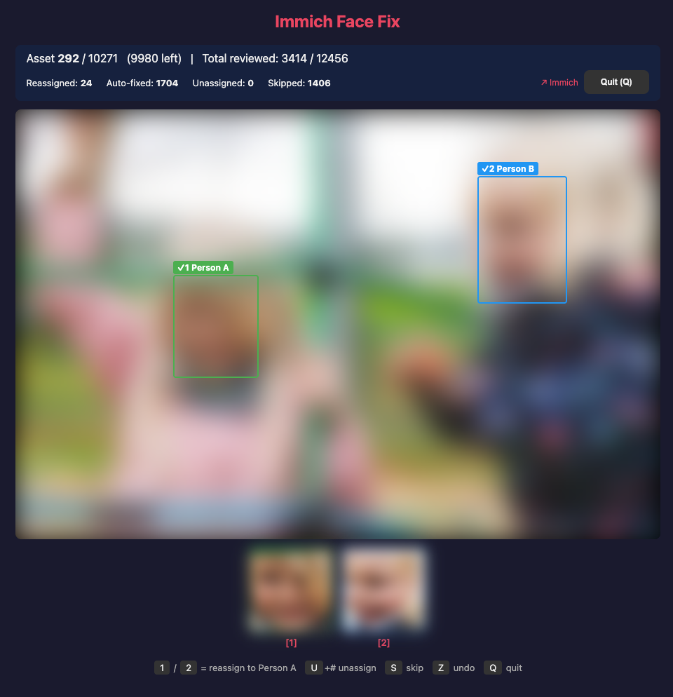

# Immich Face Fix

A web-based tool for bulk-correcting misassigned faces in [Immich](https://immich.app/), particularly useful for twins, siblings, or look-alikes where the ML model struggles to distinguish between individuals.

## The Problem

Immich's face recognition works well for most people, but it has a fundamental limitation with look-alikes. When two people (e.g., twins, young siblings) have similar facial features, their 512-dimensional embedding vectors end up very close in vector space. The ML model assigns faces by nearest-neighbor search — if the closest known face belongs to Person A, the new face gets assigned to Person A, even if it's actually Person B.

For a large, already-processed photo library, the standard advice is to lower the **Maximum recognition distance** (`maxDistance`) and re-run face recognition. Here's why that doesn't work well in practice:

### Why lowering `maxDistance` + rescanning falls short

| | Lowering maxDistance + rescan | Immich Face Fix |
|---|---|---|
| **Scope** | Reprocesses your *entire* library — every face, every photo | Only touches the specific person pair you select |
| **Time** | Hours to days for large libraries (10k+ photos) | Minutes of interactive review |
| **Collateral damage** | Stricter threshold causes *other* people to fragment into multiple persons — you fix twins but break everyone else | Zero impact on other people |
| **Manual work lost** | A full rescan discards all your previous manual merges, name assignments, and corrections | Preserves everything — only changes what you explicitly approve |
| **Precision** | Blunt instrument — same threshold applied globally to faces that vary wildly in quality and similarity | Per-face decisions with full photo context, face crops, and undo |
| **Reversibility** | Hard to undo — you'd need to re-merge split persons manually | Full undo stack, every reassignment can be reversed instantly |

The core issue is that `maxDistance` is a **global** parameter. Twins as toddlers may need a threshold of 0.3 to separate, but at that distance your library will fragment — distinct people whose faces happen to be slightly varied (different lighting, angles, ages) get split into multiple persons. There is no single threshold that correctly separates look-alikes while keeping everyone else intact.

### Why targeted corrections actually work

Immich does **not** use averaged embeddings per person. It stores every individual face embedding and searches against all of them. This means:

- When you reassign a face from Person A to Person B, that embedding immediately becomes a reference point for Person B
- Manual assignments are treated identically to ML-detected ones during future recognition
- Each correction makes future recognition more accurate — you're adding real training data to the search index
- You don't need to fix every photo; even a subset of corrections across age ranges significantly improves accuracy
- As subjects age and their features diverge, recognition naturally improves on its own



## Features

- **Person pair selection** — pick the "wrong" person (has misassigned faces) and the "correct" person (who those faces belong to)
- **Smart filtering** — review duplicates only (photos where both people appear), solos only, or both
- **Auto-fix mode** — when Immich's own top suggestion matches the correct person, auto-reassign instantly or with a configurable countdown you can cancel
- **Face overlays & crops** — bounding boxes on the full photo plus zoomed-in face crops so you can see exactly what you're reassigning
- **Unassign faces** — press `U` to remove a face from the wrong person entirely (creates a new unnamed person, same as Immich's "not this person"). In dup mode, press `U` then a number to pick which face
- **Keyboard-driven** — `Y`/`N` for solo faces, `1`-`9` to pick which face in multi-face photos, `U` to unassign, `S` skip, `Z` undo, `Q` quit
- **Session persistence** — progress saved to localStorage, resume where you left off across browser sessions
- **Full undo stack** — every reassignment can be reversed
- **Skip-both-present** — automatically skip photos where both people already appear correctly

## Setup

### Requirements

- A running [Immich](https://immich.app/) instance
- An Immich API key with the required permissions (see below)
- Python 3 (no external dependencies)

### API Key Permissions

When creating the API key in Immich (Account Settings → API Keys), grant the following permissions:

| Permission | Why |
|---|---|
| `Asset.Read` | Search assets by person |
| `Asset.View` | Load photo thumbnails/previews |
| `Face.Read` | Get face bounding boxes per asset |
| `Face.Update` | Reassign a face to a different person |
| `Person.Create` | Create unnamed person for unassign action |
| `Person.Delete` | Clean up orphaned unnamed person on undo |
| `Person.Read` | List people, get thumbnails, get top suggestion |
| `Person.Reassign` | Reassign faces between people |
| `Server.About` | Connectivity check on startup |

These are the minimum permissions required. Do **not** use an "All" key if you want to limit the blast radius.

### Running

1. Clone this repository:
   ```bash
   git clone https://github.com/pabera/immich-face-fix.git
   cd immich-face-fix
   ```

2. Start the server:
   ```bash
   python3 serve.py --immich-url https://photos.example.com --api-key your-api-key-here
   ```

The tool opens automatically in your browser at `http://localhost:8080`.

### Options

| Flag | Description | Default |
|------|-------------|---------|
| `--immich-url` | Immich instance URL | `IMMICH_URL` env var |
| `--api-key` | Immich API key | `IMMICH_API_KEY` env var |
| `--port` | Local port | 8080 |

## Usage

1. **Select the wrong person** — the person in Immich who has faces that don't belong to them
2. **Select the correct person** — who those faces actually belong to
3. **Configure settings** — filter mode, auto-fix behavior, skip-both-present
4. **Start Review** — the tool fetches all assets assigned to the wrong person and walks you through them one by one
5. **Review each photo:**
   - **Solo face** (one wrong face on the photo): `Y` to reassign, `N` to keep, `U` to unassign
   - **Duplicate faces** (multiple wrong faces): press `1`, `2`, etc. to reassign a specific face; `U` then a number to unassign
   - `S` to skip, `Z` to undo last action, `Q` to quit
6. **Summary** — shows totals for reviewed, reassigned, auto-fixed, unassigned, skipped, and undone

## How It Works

### Architecture

A single-page application (`index.html`) served by a lightweight Python proxy (`serve.py`). The proxy forwards `/api/*` requests to your Immich instance with the API key injected server-side — no credentials are exposed to the browser.

All face reassignments use the official [Immich API](https://immich.app/docs/api/). No direct database access required.

### Auto-Fix

For each face assigned to the wrong person, the tool queries Immich for its top recognition suggestion. If Immich itself thinks the face belongs to the correct person, auto-fix can:

- **Instant mode** — reassign immediately without showing the photo
- **Confirm mode** — show the photo with a countdown timer; press any key to cancel and review manually
- **Off** — always require manual review

### Session Persistence

Progress is keyed by the wrong/correct person pair and stored in localStorage. You can close the browser, come back later, and pick up where you left off. Reset a session from the setup screen if needed.

## Immich Face Recognition Internals

For those interested in how Immich's recognition works under the hood:

### Face Detection & Embedding

1. Photos are processed by the ML service (default model: `buffalo_l` / ArcFace)
2. Each detected face produces a **512-dimensional embedding vector**
3. Embeddings are stored in PostgreSQL using the `vector` type with an HNSW index for fast similarity search

### Recognition

1. A new face's embedding is compared against **all stored face embeddings** via cosine distance
2. If the closest match is within `maxDistance` (default **0.5**) and belongs to a named person, the face is assigned to that person
3. Otherwise, if enough similar unassigned faces exist (`minFaces`, default **3**), a new person is created

### The Look-Alike Trap

Twins/siblings as babies often have embeddings within 0.3–0.4 cosine distance — well inside the 0.5 default threshold. Whichever person gets more photos processed first "captures" the other's faces, since their existing embeddings become the closest matches. Lowering the threshold globally breaks other people; targeted correction is the only precise fix.

### Key Parameters

| Parameter | Default | Description |
|-----------|---------|-------------|
| `maxDistance` | 0.5 | Cosine distance threshold. Lower = stricter. Range: 0 (identical) to 2 (opposite). |
| `minFaces` | 3 | Minimum similar unassigned faces before creating a new person. |
| `minScore` | 0.7 | Face detection confidence threshold. |

## License

MIT
